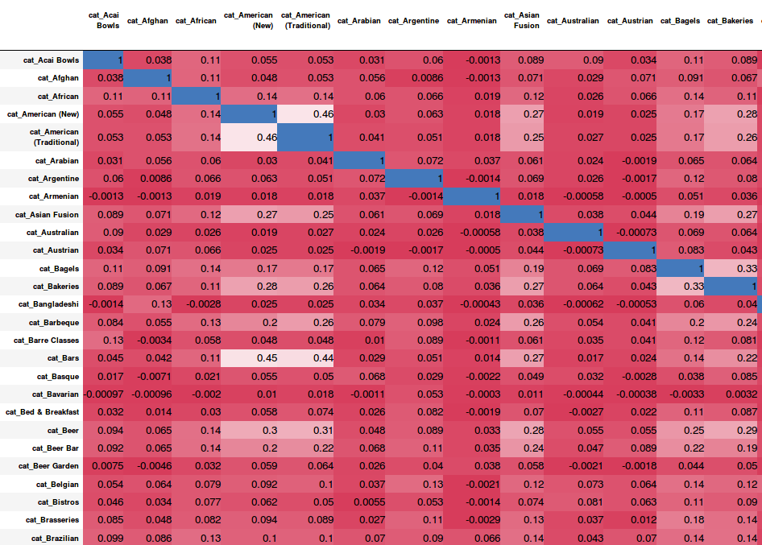

# Friend Recommendation using Link Predection Techniques

Yelp is one of the most popular platforms for searching restaurants and local businesses with their reviews and ratings. Yelp has a large user base. Currently, Yelp is providing their datasets for the students for academic purpose so that students can develop innovative analytics and data science applications. 

Currently, Yelp has the functionality where users can send friend requests to other users and follow them to see ratings and reviews. However, current Yelp users find it difficult to look for the people that matches their preferences or taste. Our idea is to develop a recommendation system using the dataset to suggest friends and influencers to the users to by predicting possible edges in the network.

To implement these functions, this project uses following concepts:
* Use the rating and categories of the restaurants users have visited.
* Users with most common neighbors.
* Influential users based on the useful ratings they have given at a geographic locations.

NetworkX Library
* Eigenvector Centrality
* Cosine Similarity
* Jaccard Coefficient
* Prefrential Attachment

